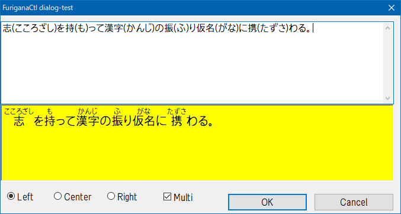

# `FuriganaCtl` - ルビ付きテキスト表示コントロール for Win32

**`FuriganaCtl`** は、Windows 上で動作する「ルビ付きテキスト表示コントロール」です。  
禁則処理、英単語単位のワードラップ、スクロール、選択、コピーなどをサポートします。  
純粋な Win32 環境で動作し、C++03 (Visual C++ 2008) でもビルド可能です。



## 概要

- **名前:** `FuriganaCtl`
- **目的:** ルビ（ふりがな）付きテキストを美しく表示する Win32 コントロール
- **開発環境:** C++/Win32
- **ビルド:** CMake + MinGW または MSVC
- **ライセンス:** MIT License

## 主な特徴

| 機能                   | 説明                                                          |
|------------------------|---------------------------------------------------------------|
| **ルビ対応**           | `漢字(ふりがな)` または `{漢字(ふりがな)}` の形式で指定可能   |
| **禁則処理**           | 行頭・行末禁則を自動処理（句読点、カッコ類など）              |
| **ワードラップ**       | 英単語単位で改行、単語途中では折り返さない                    |
| **ルビ倍率指定**       | 本文フォントに対するルビフォント比を `FC_SETRUBYRATIO` で制御 |
| **理想サイズ計算**     | `FC_GETIDEALSIZE` により自動サイズ算出                        |
| **4色テーマ**          | テキスト、背景、選択テキスト、選択背景色を個別に設定可能      |
| **スクロールバー内蔵** | 水平／垂直スクロールをサポート                                |
| **選択とコピー**       | マウス／キーボードで選択、`Ctrl+C` でコピー可能               |
| **キーボード操作**     | 矢印キー、`PageUp`/`PageDown`、`Home`/`End`、`Ctrl+A` 対応    |
| **軽量・依存なし**     | Win32 API のみ使用、MFC・ATL不要                              |

## 使用方法

### 1. DLLを読み込む

```cpp
LoadLibraryW(L"FuriganaCtl.dll");
```

クラス`FuriganaCtl`が登録されます。

### 2. ウィンドウ作成

```cpp
HWND hwndFurigana = CreateWindowW(
    L"FuriganaCtl",
    L"{漢字(かんじ)} は nice weather です。",
    WS_CHILD | WS_VISIBLE | WS_VSCROLL | WS_HSCROLL | ES_MULTILINE,
    10, 10, 300, 200,
    hwndParent,
    NULL,
    hInst,
    NULL);
```

ダイアログ リソースからでも作成できます。

### 3. ウィンドウにテキストをセット

```cpp
SetWindowTextW(hwndFurigana, L"漢字(かんじ)の連続(れんぞく)にフリガナを付(つ)けられます。");
```

## 対応スタイル一覧

| 定数              |    値 | 説明              |
| ----------------- | ----- | ----------------- |
| `ES_LEFT`         |     0 | 左そろえ          |
| `ES_CENTER`       |   0x1 | 水平中央そろえ    |
| `ES_RIGHT`        |   0x2 | 右そろえ          |
| `ES_MULTILINE`    |   0x4 | 複数行対応        |
| `ES_AUTOHSCROLL`  |  0x80 | 横スクロール対応  |

## カスタムメッセージ一覧

| 定数              | WPARAM               | LPARAM                          | 説明                                 |
| ----------------- | -------------------- | ------------------------------- | -------------------------------------|
| `FC_SETRUBYRATIO` | 分子(自然数)         | 分母(自然数)                    | ルビ倍率設定 (0 < 分子 / 分母 ≦ 1)  |
| `FC_SETMARGIN`    | 0                    | `RECT *`                        | 余白設定（`NULL`でデフォルトに戻す） |
| `FC_SETCOLOR`     | 色インデックス(0-3)  | `COLORREF` または `CLR_INVALID` | 色の設定／リセット                   |
| `FC_GETIDEALSIZE` | 0=枠付き, 1=内容のみ | `RECT *`                        | 理想的な描画サイズを取得             |
| `FC_SETLINEGAP`   | 行間(px)             | 0                               | 行間設定                             |

## 色インデックス

| インデックス | 意味           | 初期値                |
| ------------ | -------------- | --------------------- |
| 0            | テキスト色     | `COLOR_WINDOWTEXT`    |
| 1            | 背景色         | `COLOR_WINDOW`        |
| 2            | 選択テキスト色 | `COLOR_HIGHLIGHTTEXT` |
| 3            | 選択背景色     | `COLOR_HIGHLIGHT`     |

## 作者

**`katahiromz`**

* Twitter: [`@katahiromz`](https://twitter.com/katahiromz)
* Blog: [`https://katahiromz.fc2.page/`](https://katahiromz.fc2.page/)

---
Copyright &copy; 2025 katahiromz
